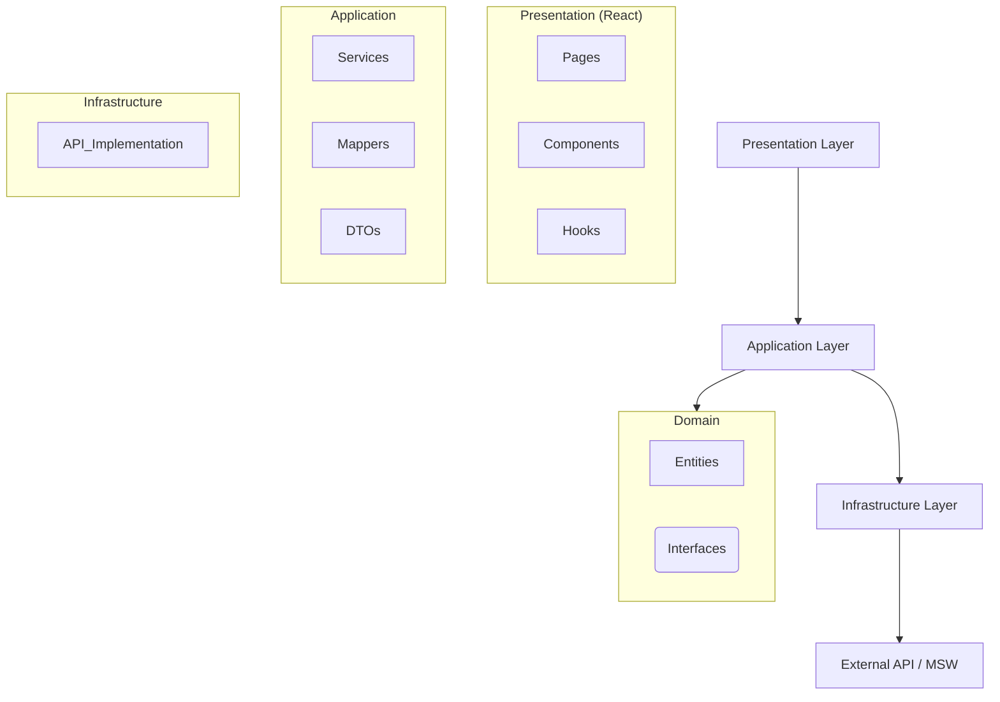

# 📦 Meli Frontend - Search Experience Demo

> **Una demo moderna de experiencia de búsqueda estilo Mercado Libre construida con Clean Architecture y las últimas tecnologías web**

<div align="center">


[](https://opensource.org/licenses/MIT)
[](http://makeapullrequest.com)

</div>

---

## 📖 Tabla de Contenidos

- [✨ Características](#-características)
- [🚀 Inicio Rápido](#-inicio-rápido)
- [🏗️ Arquitectura](#️-arquitectura)
- [📁 Estructura del Proyecto](#-estructura-del-proyecto)
- [🎯 Funcionalidades](#-funcionalidades)
- [🛠️ Stack Tecnológico](#️-stack-tecnológico)
- [✅ Pruebas y Calidad](#-pruebas-y-calidad)
- [⚡ Performance](#-performance)
- [🚀 Deployment](#-deployment)
- [🤝 Contribución](#-contribución)
- [📄 Licencia](#-licencia)

---

## ✨ Características

### 🎯 **Funcionalidades Principales**

- 🔍 **Búsqueda de Productos** - Caja de búsqueda centralizada y optimizada
- 📋 **Resultados de Búsqueda** - Listado de productos con información clave (precio, envío, ubicación)
- 🛍️ **Detalle de Producto** - Vista detallada con galería de imágenes, descripción y precio
- 🍞 **Navegación Intuitiva** - Breadcrumbs dinámicos y navegación fluida

### 🎨 **Experiencia de Usuario**

- 📱 **100% Responsive** - Adaptado a móviles, tablets y escritorio
- ✨ **UI Moderna** - Diseño limpio inspirado en Mercado Libre
- ⚡ **Feedback Visual** - Estados de carga (skeletons) y manejo de errores amigable
- ♿ **Accesibilidad** - Atributos ARIA y roles para lectores de pantalla

### 🛡️ **Calidad y Arquitectura**

- 🏗️ **Clean Architecture** - Separación estricta de responsabilidades
- 🧩 **Domain-Driven Design (DDD)** - Modelado basado en el dominio del negocio
- 🧪 **Test Coverage >90%** - Pruebas unitarias e integración robustas
- 🔄 **Mock Service Worker** - Simulación de API para desarrollo y pruebas fiables

---

## 🚀 Inicio Rápido

### 📋 Prerrequisitos

```bash
# Versiones mínimas recomendadas
node >= 18.0.0
yarn >= 1.22.0
```

### ⚡ Instalación

1. **Clonar el repositorio**

```bash
git clone https://github.com/jhorman10/meli-frontend.git
cd meli-frontend
```

2. **Instalar dependencias**

```bash
yarn install
```

3. **Ejecutar la aplicación en modo desarrollo**

```bash
yarn dev
```

🌐 **Aplicación disponible en:** `http://localhost:5173`

### 🛠️ Scripts Disponibles

```bash
# 🚀 Desarrollo
yarn dev              # Servidor de desarrollo con Vite

# 🏗️ Construcción
yarn build            # Build optimizado para producción
yarn preview          # Preview de la build generada

# 🔍 Calidad de Código
yarn lint             # Ejecutar ESLint
yarn format           # Formatear código con Prettier

# 🧪 Pruebas
yarn test             # Ejecutar todos los tests
yarn test:coverage    # Generar reporte de cobertura
```

---

## 🏗️ Arquitectura

El proyecto sigue los principios de **Clean Architecture** para garantizar escalabilidad, mantenibilidad y testabilidad.



### 🎯 **Principios de Diseño**

- **Independencia de Frameworks:** La lógica de negocio no depende de React.
- **Testabilidad:** La lógica de negocio puede probarse sin UI, base de datos o servidor web.
- **Independencia de UI:** La UI puede cambiar sin cambiar el resto del sistema.
- **Independencia de Base de Datos/API:** La infraestructura puede ser reemplazada fácilmente.

---

## 📁 Estructura del Proyecto

```text
src/
├─ application/
│   ├─ di/               # Configuración de inyección de dependencias
│   ├─ dto/              # Data Transfer Objects
│   ├─ hooks/            # Custom hooks (useSearchPage, useProductDetailPage, …)
│   ├─ mappers/          # Conversores entre DTOs y entidades del dominio
│   └─ services/         # Servicios que consumen la API mockeada
├─ domain/
│   ├─ entities/         # Entidades del negocio (p. ej. Product)
│   ├─ repositories/     # Interfaces de repositorio
│   └─ use-cases/        # Casos de uso (GetProductById, SearchProducts)
├─ infrastructure/
│   ├─ api/              # Clientes HTTP (ProductAPI)
│   └─ mocks/            # Mock Service Worker handlers
├─ presentation/
│   ├─ components/       # UI reusable (SearchBar, ProductCard, ImageLightbox, …)
│   ├─ layouts/          # Layouts globales (MainLayout)
│   ├─ pages/            # SearchPage, SearchResultsPage, ProductDetailPage
│   └─ router/           # Configuración de rutas (AppRouter)
├─ shared/
│   ├─ constants/        # strings, currency, error messages
│   └─ utils/            # formatters, calculations
└─ __tests__/           # Tests unitarios y de integración
```

---

## 🎯 Funcionalidades

### 🔍 **Búsqueda y Resultados**

| 📋 Componente     | 📝 Descripción                                                             |
| ----------------- | -------------------------------------------------------------------------- |
| **SearchBar**     | Input controlado con debounce y validación de longitud mínima.             |
| **SearchResults** | Lista paginada de productos con vista previa rica (precio, cuotas, envío). |
| **SEO**           | Gestión de meta tags dinámicos con `react-helmet-async`.                   |

### 🛍️ **Detalle de Producto**

- **Galería:** Visualización de imagen principal y miniaturas con **Lightbox** para zoom.
- **Información:** Precio formateado, cuotas, descuento, condición y envío.
- **Descripción:** Texto completo del producto con soporte para saltos de línea.
- **Breadcrumbs:** Navegación contextual basada en categorías.
- **Arquitectura Modular:** Dividido en subcomponentes (`ProductHeader`, `ProductPrice`, `ProductDescription`, etc.) para facilitar el mantenimiento.

---

## 🛠️ Stack Tecnológico

### 🎯 **Core**

```json
{
  "react": "19.2.0", // Biblioteca UI
  "typescript": "5.9.3", // Tipado estático
  "vite": "5.4.0" // Build tool y servidor de desarrollo
}
```

### 🎨 **Estilos**

```json
{
  "tailwindcss": "4.1.17", // Framework CSS utility-first
  "flowbite-react": "0.12.10", // Componentes UI base
  "autoprefixer": "10.4.22" // PostCSS plugin
}
```

### 🧪 **Testing**

```json
{
  "jest": "30.2.0", // Runner de pruebas
  "@testing-library/react": "14", // Testing de componentes
  "msw": "2.12.2" // Mock Service Worker para API
}
```

---

## ✅ Pruebas y Calidad

El proyecto mantiene un alto estándar de calidad con una cobertura de código superior al 90%.

### 📊 **Cobertura Actual**

- **Hooks:** 100%
- **Servicios:** 100%
- **Mappers:** 100%
- **Componentes Críticos:** >90%

### 🧪 **Ejecutar Pruebas**

```bash
# Ejecutar todos los tests
yarn test

# Ver reporte de cobertura
yarn test:coverage
```

---

## ⚡ Performance y Optimizaciones

El proyecto implementa múltiples estrategias para garantizar una experiencia de usuario fluida y eficiente:

### 🔄 **Memoización y Control de Renderizado**

- **`React.memo`**: Se aplica en componentes de lista y tarjetas (`ProductList`, `ProductCard`, `ProductGallery`) para prevenir re-renderizados innecesarios cuando las props no cambian. Esto es crítico en listas largas de productos.
- **`useMemo`**: Utilizado en `ProductGallery` para memorizar operaciones costosas, como el recorte (`slice`) del array de imágenes para las miniaturas, asegurando que solo se recalcule cuando las imágenes cambian.
- **`useCallback`**: Implementado en hooks personalizados (como `useSearchProducts`) para memorizar funciones de búsqueda y manejadores de eventos, manteniendo la estabilidad de las referencias y evitando efectos secundarios no deseados en componentes hijos.

### ⏱️ **Optimización de Búsqueda (Debounce)**

- **`useDebounce`**: Se implementó un custom hook de debounce para retrasar la ejecución de la búsqueda automática.
- **Integración en `useSearchBar`**: Permite que la búsqueda se dispare automáticamente solo después de que el usuario ha dejado de escribir por 500ms, reduciendo drásticamente las llamadas innecesarias a la API y mejorando la respuesta de la interfaz.

### 📦 **Carga Diferida (Lazy Loading & Code Splitting)**

- **Rutas**: Uso de `React.lazy` y `Suspense` en `AppRouter` para dividir el código por rutas (`SearchPage`, `SearchResultsPage`, `ProductDetailPage`). El usuario solo descarga el JavaScript necesario para la página que está visitando.
- **Imágenes**: Atributo `loading="lazy"` en todas las etiquetas `` (especialmente en `ProductCard` y `ProductGallery`) para diferir la carga de imágenes fuera del viewport, ahorrando ancho de banda y acelerando el tiempo de carga inicial (LCP).

### 🎨 **Otras Mejoras**

- **Skeletons**: Implementación de estados de carga visuales (`ProductCardSkeleton`, `ProductDetailSkeleton`) para mejorar la percepción de velocidad (CLS) y evitar saltos de contenido.
- **Virtualización (Preparado)**: La estructura de `ProductList` está diseñada para facilitar la integración futura de virtualización (windowing) si el dataset crece significativamente.

---

## 🚀 Deployment

El proyecto está listo para ser desplegado en plataformas como Vercel o Netlify.

### 🌐 **Vercel**

1. Conectar repositorio de GitHub.
2. Configurar Build Command: `yarn build`.
3. Configurar Output Directory: `dist`.
4. ¡Desplegar!

---

## 🤝 Contribución

¡Las contribuciones son bienvenidas! Por favor, sigue estos pasos:

1.  Haz un Fork del proyecto.
2.  Crea una rama para tu feature (`git checkout -b feature/AmazingFeature`).
3.  Haz commit de tus cambios (`git commit -m 'feat: Add some AmazingFeature'`).
4.  Push a la rama (`git push origin feature/AmazingFeature`).
5.  Abre un Pull Request.

---

## � Licencia

Este proyecto está bajo la licencia **MIT**.

```
MIT License

Copyright (c) 2024 Jhorman Orozco

Permission is hereby granted, free of charge, to any person obtaining a copy
of this software and associated documentation files (the "Software"), to deal
in the Software without restriction, including without limitation the rights
to use, copy, modify, merge, publish, distribute, sublicense, and/or sell
copies of the Software, and to permit persons to whom the Software is
furnished to do so, subject to the following conditions:

The above copyright notice and this permission notice shall be included in all
copies or substantial portions of the Software.

THE SOFTWARE IS PROVIDED "AS IS", WITHOUT WARRANTY OF ANY KIND, EXPRESS OR
IMPLIED, INCLUDING BUT NOT LIMITED TO THE WARRANTIES OF MERCHANTABILITY,
FITNESS FOR A PARTICULAR PURPOSE AND NONINFRINGEMENT. IN NO EVENT SHALL THE
AUTHORS OR COPYRIGHT HOLDERS BE LIABLE FOR ANY CLAIM, DAMAGES OR OTHER
LIABILITY, WHETHER IN AN ACTION OF CONTRACT, TORT OR OTHERWISE, ARISING FROM,
OUT OF OR IN CONNECTION WITH THE SOFTWARE OR THE USE OR OTHER DEALINGS IN THE
SOFTWARE.
```

---

<div align="center">

### 👨‍💻 **Jhorman Orozco**

_Full Stack Developer_

[](https://github.com/jhorman10)
[](https://linkedin.com/in/jhorman-orozco)

</div>
